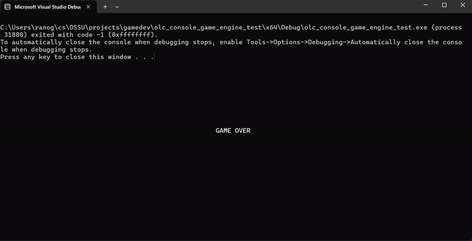

# PongGame

A simple console-based game in C++ using [olcConsoleGameEngine](https://github.com/OneLoneCoder/Javidx9/blob/master/ConsoleGameEngine/olcConsoleGameEngine.h) by Javidx9, which provides easy 2D console graphics.

## Overview
* A single player-controlled paddle.
* A bouncing ball with simple collision detection.
* Score tracking and a game-over state.

## Features

* Player-controlled paddle movement.
* Ball movement with basic physics.
* Score tracking.
* Game over when the ball passes the bottom of the screen.

